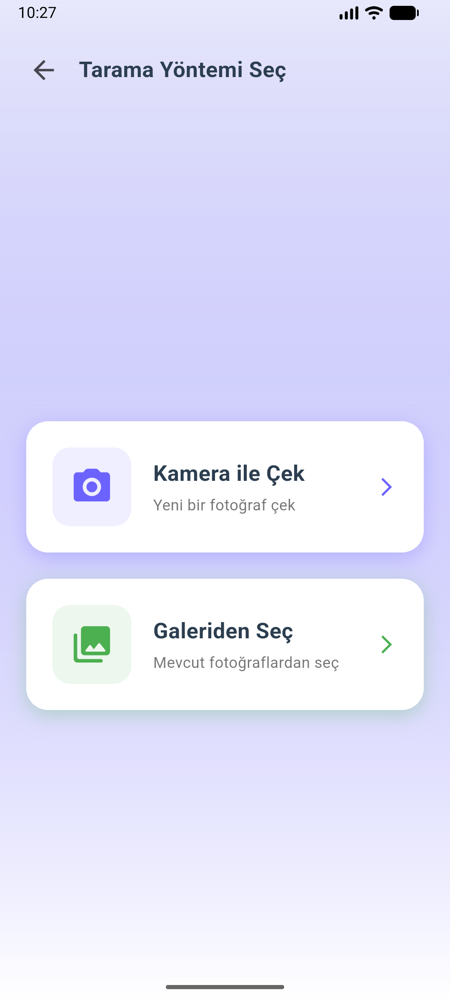

# Atık Tespit - Waste Detection App

Yapay zeka destekli atık tespit ve sınıflandırma mobil uygulaması.

## Proje Hakkında

Atık Tespit, YOLOv8 modeli kullanarak atık nesneleri tespit eden ve sınıflandıran bir Flutter uygulamasıdır. Uygulama, çevre bilincini artırmak ve doğru geri dönüşüm alışkanlıklarını desteklemek amacıyla geliştirilmiştir.

## Özellikler

- **Kamera ile Tespit**: Gerçek zamanlı kamera ile atık fotoğrafı çekme
- **Galeri Desteği**: Galeriden fotoğraf seçerek tespit yapma
- **5 Sınıf Tespiti**:
  - Cam (Glass)
  - Metal (Metal)
  - Organik (Organic)
  - Kağıt (Paper)
  - Plastik (Plastic)
- **Tespit Sonuçları**: Bounding box ile görselleştirme
- **Doğruluk Oranı**: Her tespit için güven skoru
- **Geçmiş Kayıtları**: Önceki taramaları görüntüleme
- **Veri Yönetimi**: Tüm geçmişi temizleme

## Teknolojiler

- **Framework**: Flutter 3.x
- **Dil**: Dart
- **AI Model**: YOLOv8 (TensorFlow Lite)
- **Veritabanı**: SQLite
- **Kamera**: camera ^0.10.5
- **ML**: tflite_flutter ^0.11.0
- **Görsel İşleme**: image ^4.1.7

## Gereksinimler

- Flutter SDK 3.0 veya üzeri
- Dart SDK 3.0 veya üzeri
- Android Studio / VS Code
- Android: minSdkVersion 26
- iOS: iOS 12.0 veya üzeri

## Kurulum

1. **Projeyi klonlayın**
```bash
git clone https://github.com/kullaniciadi/atik.git
cd atik
```

2. **Bağımlılıkları yükleyin**
```bash
flutter pub get
```

3. **Uygulamayı çalıştırın**
```bash
flutter run
```

## Bağımlılıklar

```yaml
dependencies:
  flutter:
    sdk: flutter
  camera: ^0.10.5
  tflite_flutter: ^0.11.0
  sqflite: ^2.3.0
  image_picker: ^1.0.7
  path_provider: ^2.1.1
  image: ^4.1.7
```

## Ekran Görüntüleri

<p align="center">
  
  
  
</p>

<p align="center">
  
  
  
</p>

## Proje Yapısı

```
lib/
├── main.dart                    # Ana uygulama
├── models/                      # Veri modelleri
│   ├── detection_result.dart
│   └── scan_history.dart
├── screens/                     # Ekranlar
│   ├── splash_screen.dart
│   ├── home_screen.dart
│   ├── scan_options_screen.dart
│   ├── scan_screen.dart
│   ├── result_screen.dart
│   └── history_screen.dart
├── services/                    # Servisler
│   ├── detection_service.dart   # ML model servisi
│   └── database_service.dart    # SQLite servisi
├── widgets/                     # Özel widget'lar
│   └── detection_painter.dart   # Bounding box çizimi
└── utils/                       # Yardımcı dosyalar
    └── app_theme.dart
```

## Model Eğitimi

Kendi modelinizi eğitmek için:
1. Veri setinizi eğitin
2. Modeli TFLite formatına dönüştürün
3. `assets/` klasörüne yerleştirin
4. `lib/services/detection_service.dart` dosyasında model adını güncelleyin
