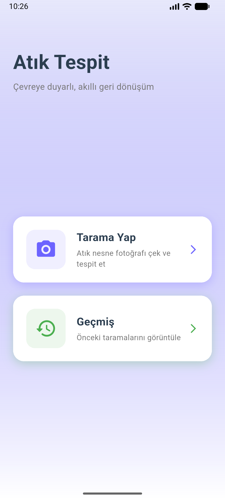
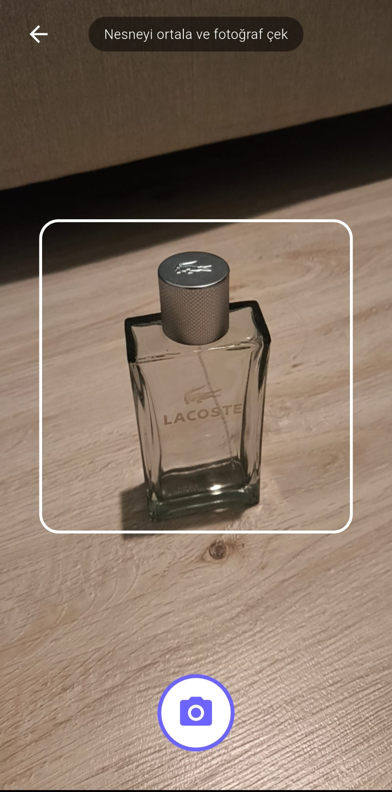
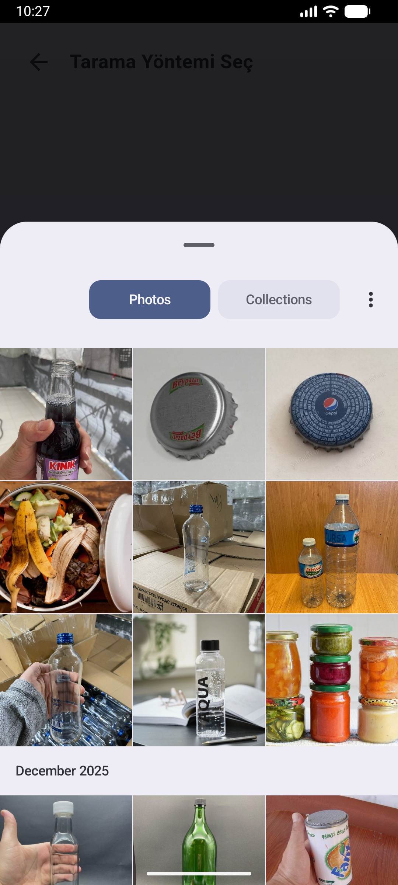
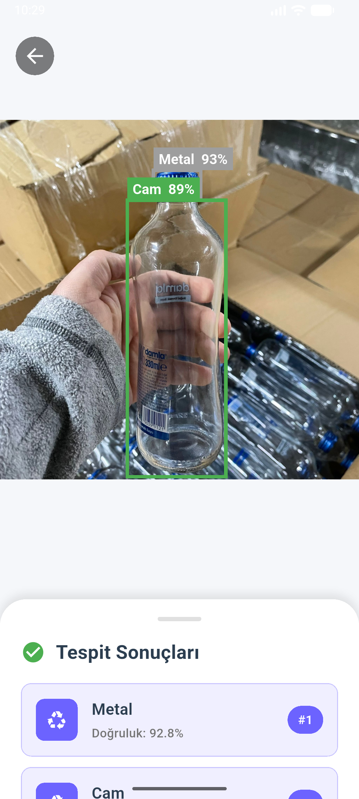
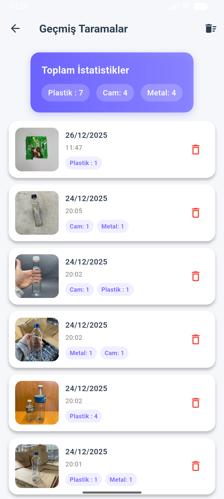

<div align="center">

[English](#english) | [Türkçe](#türkçe)

</div>

---

<a name="english"></a>
# AI-Powered Real-Time Waste Detection and Recycling Assistant

**Waste-Detection-App** is a mobile computer vision application powered by **YOLOv8** and **TensorFlow Lite**, designed to detect, classify, and guide the recycling of solid waste in real time. 

Engineered with **Clean Layered Architecture**, the application combines on-device Edge AI inference, an aspect-ratio-aware bounding box visualization engine, and atomic local persistence (SQLite + file storage) to promote environmental awareness and circular economy practices.

---

## System Architecture & Data Flow

```
                  ┌───────────────────────────────────────────────────────────┐
                  │               Perception & Ingestion Layer                │
                  │  • Camera Viewfinder (Live Video Stream / Torch / Switch) │
                  │  • Gallery Image Picker (High-Resolution JPG / PNG)       │
                  └─────────────────────────────┬─────────────────────────────┘
                                                │
                                                ▼
                  ┌───────────────────────────────────────────────────────────┐
                  │             Image Preprocessing & Tensor Bridge           │
                  │  • 640x640 Bilinear Resizing                              │
                  │  • Pixel Normalization: Float32 RGB [0.0, 1.0]            │
                  │  • Tensor Allocation: [1, 640, 640, 3]                    │
                  └─────────────────────────────┬─────────────────────────────┘
                                                │
                                                ▼
                  ┌───────────────────────────────────────────────────────────┐
                  │            YOLOv8 TFLite Neural Inference Engine          │
                  │  • Edge AI Execution: best_float32.tflite                 │
                  │  • Raw Tensor Output Parsing: [1, 9, 8400]                │
                  │  • Confidence Filtering (Threshold >= 0.65)               │
                  │  • Non-Maximum Suppression (IoU Threshold <= 0.45)        │
                  └─────────────────────────────┬─────────────────────────────┘
                                                │
                                                ▼
                  ┌───────────────────────────────────────────────────────────┐
                  │       Aspect-Ratio Aware Canvas Visualization Engine      │
                  │  • Dynamic Viewport & Letterbox/Pillarbox Compensation    │
                  │  • Color-Coded Bounding Boxes & Confidence Badges         │
                  │  • Category-Specific Eco-Action & Recycling Advice        │
                  └─────────────────────────────┬─────────────────────────────┘
                                                │
                                                ▼
                  ┌───────────────────────────────────────────────────────────┐
                  │            Atomic Data Persistence Layer (SQLite)         │
                  │  • Scan Metadata & Bounding Boxes JSON Storage            │
                  │  • Scans Directory Local Storage Synchronization          │
                  │  • Category Distribution Statistics & Aggregations        │
                  └───────────────────────────────────────────────────────────┘
```

---

## Core System Modules

1. **YOLOv8 Edge AI Inference Engine:**
   - On-device real-time neural object detection without external network dependencies.
   - Dynamic label matrix evaluation supporting 5 target waste classes with automatic class count resolution.
   - Coordinate normalization safeguard transforming bounding box coordinates ($x, y, w, h$) into scale-invariant units.
   - Non-Maximum Suppression (NMS) suppressing duplicate overlapping boxes for the same waste item.

2. **Smart Viewfinder & Camera Controller:**
   - Real-time viewfinder with alignment bounding guide.
   - Flashlight (Torch) toggle for low-light environments and seamless front/rear camera switching.
   - Full Flutter lifecycle management (`WidgetsBindingObserver`) preventing camera resource leaks.

3. **Aspect-Ratio-Aware Canvas Renderer:**
   - Custom `CustomPainter` mathematically calculating real image dimensions against viewport container constraints.
   - Eliminates bounding box drift across varying screen ratios and orientation bounds.
   - Color-coded badges with dynamic category styling and confidence percentage markers.

4. **Atomic Local Persistence & History Manager:**
   - Synchronized SQLite database storage and physical image file management.
   - Deleting a history entry atomically removes both the SQLite row and the physical disk image file.
   - Prevents redundant model re-runs and duplicate database entries when inspecting past scans.

---

## Waste Categories & Classification Matrix

| Category | Display Name | Theme Color | Class Identifier | Actionable Recycling Guide |
| :--- | :--- | :--- | :--- | :--- |
| 🟢 **Glass** | Cam | `#27AE60` (Green) | `Cam` / `Glass` | Rinse glass bottles and place them in the green/clear glass recycling bin. |
| ⚪ **Metal** | Metal | `#7F8C8D` (Grey) | `Metal` | Crush aluminum and tin cans to reduce volume before bin disposal. |
| 🟤 **Organic** | Organik | `#8D6E63` (Brown) | `Organik` | Suitable for composting or organic biowaste collection containers. |
| 🔵 **Paper** | Kağıt | `#2980B9` (Blue) | `Kagit` / `Paper` | Keep cardboard and paper clean and dry; do not mix with oily food boxes. |
| 🟡 **Plastic** | Plastik | `#F1C40F` (Yellow) | `Plastik` / `Plastic` | Empty liquids and compress plastic containers before bin disposal. |

---

## Application Interface & Visual Showcase

<p align="center">
  
  &nbsp;&nbsp;&nbsp;&nbsp;
  
  &nbsp;&nbsp;&nbsp;&nbsp;
  
</p>
<p align="center">
  <em>(Left) Home Dashboard &mdash; (Middle) Input Ingestion Selection &mdash; (Right) Real-Time Viewfinder</em>
</p>

<br>

<p align="center">
  
  &nbsp;&nbsp;&nbsp;&nbsp;
  
  &nbsp;&nbsp;&nbsp;&nbsp;
  
</p>
<p align="center">
  <em>(Left) Image Ingestion &mdash; (Middle) Detection Results & Bounding Boxes &mdash; (Right) Historical Analytics</em>
</p>

---

## Technical Stack

- **Framework:** Flutter 3.x (Material 3)
- **Programming Language:** Dart 3.x
- **Architecture Pattern:** Clean Layered Architecture (Core / Data / Presentation)
- **Deep Learning / On-Device ML:** YOLOv8 (`tflite_flutter ^0.11.0`)
- **Computer Vision & Image Processing:** `image ^4.1.7`
- **Camera Subsystem:** `camera ^0.10.5`
- **Local Relational Database:** SQLite via `sqflite ^2.3.0`
- **Hardware Permissions:** `permission_handler ^11.3.0`
- **Storage & Path Services:** `path_provider ^2.1.1`, `path ^1.9.0`

---

## Project Structure

```
Waste-Detection-App/
├── assets/                                 # Static Assets & ML Binaries
│   ├── best_float32.tflite                 # YOLOv8 TensorFlow Lite Model
│   └── labels.txt                          # Class Label Definitions
├── docs/                                   # Documentation & Showcase Screenshots
│   ├── home.png
│   ├── scan_options.png
│   ├── camera.png
│   ├── upload.png
│   ├── result.png
│   └── history.png
├── lib/
│   ├── core/                               # Core Utilities, Themes & Global Constants
│   │   ├── constants/
│   │   │   ├── app_colors.dart             # Central color palette and category colors
│   │   │   ├── app_constants.dart          # Thresholds, dimensions and DB constants
│   │   │   └── asset_paths.dart            # TFLite model and asset path references
│   │   ├── theme/
│   │   │   └── app_theme.dart              # Material 3 light theme configuration
│   │   └── utils/
│   │       ├── app_logger.dart             # Controlled debug logging utility
│   │       └── date_time_utils.dart        # Date and time formatting helpers
│   ├── data/                               # Data Access, Models & Repositories
│   │   ├── datasources/
│   │   │   ├── local_database_datasource.dart # SQLite database CRUD operations
│   │   │   └── tflite_detector_datasource.dart# TFLite inference and NMS execution
│   │   ├── models/
│   │   │   ├── detection_result_model.dart # Detection result data model & JSON mapper
│   │   │   ├── scan_history_model.dart     # Scan record data model
│   │   │   └── waste_category.dart         # Category enum, colors, icons & recycling tips
│   │   └── repositories/
│   │       ├── detection_repository.dart   # Image ingestion & detection coordinator
│   │       └── history_repository.dart     # Atomic history & physical file manager
│   ├── presentation/                       # Presentation & User Interface Layer
│   │   ├── history/
│   │   │   ├── history_screen.dart         # Historical scans list & analytics view
│   │   │   └── widgets/
│   │   │       ├── history_item_card.dart  # Historical scan item card
│   │   │       └── history_stats_card.dart # Category breakdown statistics card
│   │   ├── home/
│   │   │   ├── home_screen.dart            # Main dashboard welcoming interface
│   │   │   └── widgets/
│   │   │       └── home_menu_card.dart     # Dashboard navigation card
│   │   ├── result/
│   │   │   ├── result_screen.dart          # Detection results & analytics viewer
│   │   │   └── widgets/
│   │   │       ├── detection_bounding_box_painter.dart # Custom viewport bounding painter
│   │   │       └── result_item_card.dart   # Detection item breakdown card
│   │   ├── scan/
│   │   │   ├── scan_camera_screen.dart     # Camera viewfinder & capture screen
│   │   │   └── scan_options_screen.dart    # Camera vs. Gallery selection screen
│   │   └── splash/
│   │       └── splash_screen.dart          # Animated startup splash screen
│   └── main.dart                           # Application entry point
├── test/
│   └── widget_test.dart                    # Widget initialization smoke test
├── pubspec.yaml                            # Package dependencies and manifest
├── analysis_options.yaml                   # Static analysis and linter rules
└── README.md                               # Comprehensive bilingual documentation
```

---

## Installation & Execution

### 1. Clone the Repository
```bash
git clone https://github.com/furkan-ylmz/Waste-Detection-App.git
cd Waste-Detection-App
```

### 2. Install Dependencies
```bash
flutter pub get
```

### 3. Run the Application
Launch on a connected physical mobile device or emulator:
```bash
flutter run
```

### 4. Execute Test Suite
Run widget and smoke tests:
```bash
flutter test
```

<br>

---

<a name="türkçe"></a>
# Yapay Zeka Destekli Gerçek Zamanlı Atık Tespit ve Geri Dönüşüm Asistanı

**Atık Tespit (Waste-Detection-App)**, katı atıkları gerçek zamanlı olarak tespit eden, sınıflandıran ve kullanıcıyı doğru geri dönüşüm yöntemlerine yönlendiren, **YOLOv8** ve **TensorFlow Lite** tabanlı bir mobil bilgisayarla görme (computer vision) uygulamasıdır.

**Katmanlı Temiz Mimari (Clean Layered Architecture)** prensipleriyle geliştirilen uygulama; cihaz üzerinde çalışan Edge AI çıkarım motorunu, en-boy oranına duyarlı çizim katmanını ve yerel veri depolama (SQLite + dosya sistemi) altyapısını bir araya getirerek çevre bilincini ve döngüsel ekonomiyi destekler.

---

## Sistem Mimarisi ve Veri Akışı

```
                  ┌───────────────────────────────────────────────────────────┐
                  │                 Algılama ve Giriş Katmanı                 │
                  │  • Kamera Vizörü (Canlı Akış / Flaş Kontrolü / Kamera Seç)│
                  │  • Galeri Seçici (Yüksek Çözünürlüklü Fotoğraf Seçimi)    │
                  └─────────────────────────────┬─────────────────────────────┘
                                                │
                                                ▼
                  ┌───────────────────────────────────────────────────────────┐
                  │             Görsel Ön İşleme ve Tensör Dönüşümü           │
                  │  • 640x640 Boyutlandırma (Bilinear Resizing)              │
                  │  • Piksel Normalizasyonu: Float32 RGB [0.0, 1.0]          │
                  │  • Tensör Bellek Tahsisi: [1, 640, 640, 3]                │
                  └─────────────────────────────┬─────────────────────────────┘
                                                │
                                                ▼
                  ┌───────────────────────────────────────────────────────────┐
                  │           YOLOv8 TFLite Yapay Zeka Çıkarım Motoru         │
                  │  • Cihaz Üzerinde Model Çalıştırma: best_float32.tflite   │
                  │  • Ham Tensör Çıktısı Ayrıştırma: [1, 9, 8400]            │
                  │  • Güven Skoru Filtreleme (Eşik Değeri >= 0.65)           │
                  │  • Non-Maximum Suppression (IoU Eşik Değeri <= 0.45)      │
                  └─────────────────────────────┬─────────────────────────────┘
                                                │
                                                ▼
                  ┌───────────────────────────────────────────────────────────┐
                  │         En-Boy Oranına Duyarlı Çizim ve Görselleştirme    │
                  │  • Ekran Oranına Göre Dinamik Canvas ve Boşluk Telafisi   │
                  │  • Sınıfa Özel Renkli Bounding Box ve Güven Rozetleri     │
                  │  • Atık Türüne Özel Ekolojik Geri Dönüşüm Tavsiyeleri     │
                  └─────────────────────────────┬─────────────────────────────┘
                                                │
                                                ▼
                  ┌───────────────────────────────────────────────────────────┐
                  │             Atomik Veri Saklama Katmanı (SQLite)          │
                  │  • Tarama Üst Verileri ve Bounding Box JSON Kaydı         │
                  │  • Scans Dizini Fiziksel Dosya Depolama Senkronizasyonu   │
                  │  • Kategori Dağılımı ve Toplam İstatistik Hesaplamaları   │
                  └───────────────────────────────────────────────────────────┘
```

---

## Temel Sistem Modülleri

1. **YOLOv8 Cihaz İçi Yapay Zeka Motoru:**
   - İnternet bağlantısına ihtiyaç duymadan cihaz üzerinde tamamen yerel çalışan nesne tespiti.
   - 5 farklı atık sınıfını dinamik etiket desteğiyle tanıyan model mimarisi.
   - Koordinat normalizasyonu koruması ile ($x, y, w, h$) değerlerinin ekrandan bağımsız ölçeklenmesi.
   - Non-Maximum Suppression (NMS) algoritması ile aynı nesneye ait mükerrer kutuların elenmesi.

2. **Akıllı Kamera Vizörü ve Kontrolcüsü:**
   - Atık nesnesini ortalamayı sağlayan hizalama kılavuzlu vizör.
   - Düşük ışıklı ortamlar için flaş (meşale) kontrolü ve ön/arka kamera değişim desteği.
   - Uygulama arka plana geçtiğinde kamera donanımını otomatik serbest bırakan yaşam döngüsü (`WidgetsBindingObserver`) yönetimi.

3. **En-Boy Oranına Duyarlı Çizim Motoru (CustomPainter):**
   - Resmin ekranda kapladığı gerçek alanı piksel piksel hesaplayan özel `CustomPainter`.
   - Cihaz ekran oranı ile fotoğraf oranı uyuşmadığında oluşan siyah boşlukları (letterbox/pillarbox) kompanse ederek kutuların tam nesne üzerine oturmasını sağlar.
   - Sınıf renkleriyle uyumlu başlık rozetleri ve yüzde bazlı güven skoru gösterimi.

4. **Atomik Veri Depolama ve Geçmiş Yöneticisi:**
   - SQLite veritabanı ile fiziksel resim dosyalarının eşzamanlı ve atomik yönetimi.
   - Bir kayıt silindiğinde hem veritabanı satırı hem de cihaz hafızasındaki resim dosyası tek bir işlemle silinir.
   - Geçmiş kayıtları incelenirken modelin tekrar çalışması ve mükerrer veritabanı kaydı oluşturulması engellenmiştir.

---

## Atık Sınıfları ve Geri Dönüşüm Rehberi

| Kategori | Görünen Adı | Tema Rengi | Model Etiketi | Ekolojik Ayrıştırma ve Geri Dönüşüm İpucu |
| :--- | :--- | :--- | :--- | :--- |
| 🟢 **Cam** | Cam | `#27AE60` (Yeşil) | `Cam` / `Glass` | Cam şişe ve kavanozları çalkalayarak yeşil/şeffaf cam kumbaralarına atınız. |
| ⚪ **Metal** | Metal | `#7F8C8D` (Gri) | `Metal` | Metal ve alüminyum kutuları ezerek hacmini küçültüp geri dönüşüm kutusuna bırakınız. |
| 🟤 **Organik** | Organik | `#8D6E63` (Kahverengi) | `Organik` | Kompost yapılabilir veya biyolojik atık toplama haznelerine bırakılabilir. |
| 🔵 **Kağıt** | Kağıt | `#2980B9` (Mavi) | `Kagit` / `Paper` | Kağıt ve kartonları ıslanmadan ve yağlanmadan kuru olarak ayrıştırınız. |
| 🟡 **Plastik** | Plastik | `#F1C40F` (Sarı) | `Plastik` / `Plastic` | Sıvı atıklardan arındırıp kapaklarıyla birlikte plastik kumbarasına atınız. |

---

## Sistemin Çalışması ve Ekran Görüntüleri

<p align="center">
  
  &nbsp;&nbsp;&nbsp;&nbsp;
  
  &nbsp;&nbsp;&nbsp;&nbsp;
  
</p>
<p align="center">
  <em>(Sol) Ana Karşılama Paneli &mdash; (Orta) Tarama Kaynağı Seçimi &mdash; (Sağ) Canlı Kamera Vizörü</em>
</p>

<br>

<p align="center">
  
  &nbsp;&nbsp;&nbsp;&nbsp;
  
  &nbsp;&nbsp;&nbsp;&nbsp;
  
</p>
<p align="center">
  <em>(Sol) Fotoğraf Seçimi &mdash; (Orta) Bounding Box ve Analiz Sonuçları &mdash; (Sağ) Geçmiş ve Toplam İstatistikler</em>
</p>

---

## Teknolojik Altyapı

- **Framework:** Flutter 3.x (Material 3)
- **Programlama Dili:** Dart 3.x
- **Mimari:** Katmanlı Temiz Mimari (Clean Layered Architecture)
- **Derin Öğrenme / On-Device ML:** YOLOv8 (`tflite_flutter ^0.11.0`)
- **Görüntü İşleme:** `image ^4.1.7`
- **Kamera Alt Sistemi:** `camera ^0.10.5`
- **Yerel Veritabanı:** SQLite (`sqflite ^2.3.0`)
- **İzin Yönetimi:** `permission_handler ^11.3.0`
- **Depolama ve Dosya Yolları:** `path_provider ^2.1.1`, `path ^1.9.0`

---

## Proje Dizin Yapısı

```
Waste-Detection-App/
├── assets/                                 # Model ve Statik Varlıklar
│   ├── best_float32.tflite                 # YOLOv8 TensorFlow Lite Modeli
│   └── labels.txt                          # Sınıf Etiket Tanımları
├── docs/                                   # Dokümantasyon ve Ekran Görüntüleri
│   ├── home.png
│   ├── scan_options.png
│   ├── camera.png
│   ├── upload.png
│   ├── result.png
│   └── history.png
├── lib/
│   ├── core/                               # Yardımcı Araçlar, Tema ve Sabitler
│   │   ├── constants/
│   │   │   ├── app_colors.dart             # Renk paleti ve sınıf renk eşleştirmeleri
│   │   │   ├── app_constants.dart          # Model boyutları, eşikler ve DB sabitleri
│   │   │   └── asset_paths.dart            # TFLite model ve etiket yolları
│   │   ├── theme/
│   │   │   └── app_theme.dart              # Material 3 tema yapılandırması
│   │   └── utils/
│   │       ├── app_logger.dart             # Kontrollü loglama aracı
│   │       └── date_time_utils.dart        # Tarih ve saat formatlama yardımcıları
│   ├── data/                               # Veri Katmanı, Modeller ve Depolar
│   │   ├── datasources/
│   │   │   ├── local_database_datasource.dart # SQLite CRUD işlemleri
│   │   │   └── tflite_detector_datasource.dart# TFLite inference ve NMS motoru
│   │   ├── models/
│   │   │   ├── detection_result_model.dart # Tespit sonucu veri modeli
│   │   │   ├── scan_history_model.dart     # Tarama geçmişi veri modeli
│   │   │   └── waste_category.dart         # Kategori enum, renk, ikon ve tavsiyeler
│   │   └── repositories/
│   │       ├── detection_repository.dart   # Model çalıştırma ve görsel depolama
│   │       └── history_repository.dart     # Atomik geçmiş ve dosya silme yöneticisi
│   ├── presentation/                       # Kullanıcı Arayüzü (UI) Katmanı
│   │   ├── history/
│   │   │   ├── history_screen.dart         # Geçmiş listesi ve istatistik ekranı
│   │   │   └── widgets/
│   │   │       ├── history_item_card.dart  # Geçmiş kartı bileşeni
│   │   │       └── history_stats_card.dart # İstatistik kartı bileşeni
│   │   ├── home/
│   │   │   ├── home_screen.dart            # Ana karşılama ekranı
│   │   │   └── widgets/
│   │   │       └── home_menu_card.dart     # Menü kartı bileşeni
│   │   ├── result/
│   │   │   ├── result_screen.dart          # Analiz ve tespit sonuç ekranı
│   │   │   └── widgets/
│   │   │       ├── detection_bounding_box_painter.dart # Hassas çizim bileşeni
│   │   │       └── result_item_card.dart   # Tespit edilen nesne kartı
│   │   ├── scan/
│   │   │   ├── scan_camera_screen.dart     # Kamera vizör ve çekim ekranı
│   │   │   └── scan_options_screen.dart    # Yöntem seçimi ekranı
│   │   └── splash/
│   │       └── splash_screen.dart          # Animasyonlu açılış ekranı
│   └── main.dart                           # Uygulama giriş noktası
├── test/
│   └── widget_test.dart                    # Başlangıç ve smoke testleri
├── pubspec.yaml                            # Paket ve bağımlılık manifestosu
├── analysis_options.yaml                   # Statik analiz ve linter kuralları
└── README.md                               # Kapsamlı iki dilli dokümantasyon
```

---

## Kurulum ve Çalıştırma

### 1. Depoyu Klonlayın
```bash
git clone https://github.com/furkan-ylmz/Waste-Detection-App.git
cd Waste-Detection-App
```

### 2. Bağımlılıkları Yükleyin
```bash
flutter pub get
```

### 3. Uygulamayı Çalıştırın
Bağlı bir fiziksel cihaz veya emülatör üzerinde çalıştırın:
```bash
flutter run
```

### 4. Testleri Çalıştırın
```bash
flutter test
```
